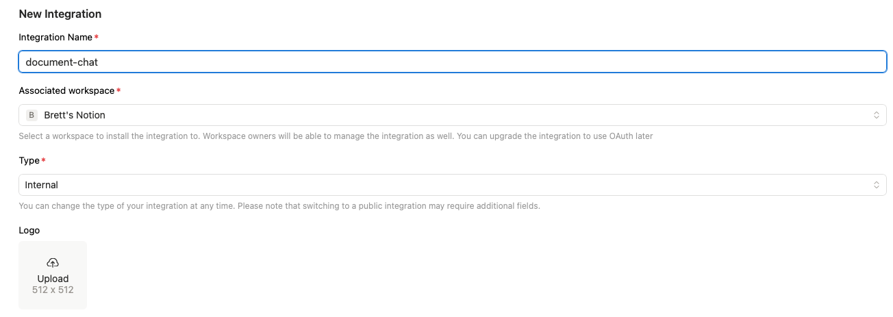
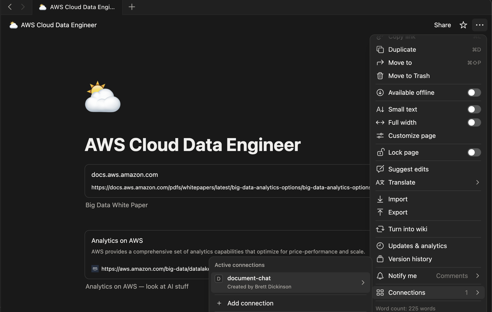
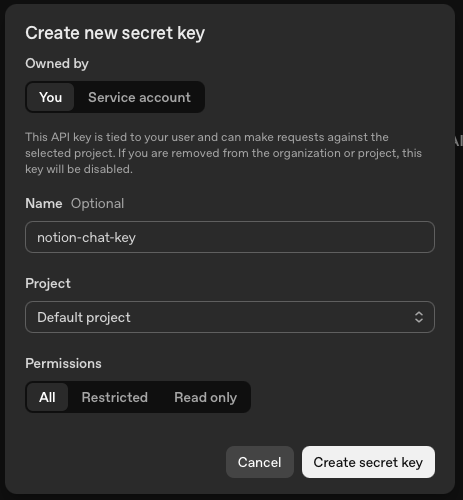

# Notion Chat
Chat with your Notion documentation using OpenAI API. This sets up a path for processing your Notion documentation, loading to a vectorstore, and asking questions using a Chainlit chat UI. Originally forked off [this repo](https://github.com/sudarshan-koirala/llama2-different-vectorstores) for an easy way to build off the vectorstores and just add support for processing notion pages.

<video controls src="./resources/notion-chat-example.mov" title="Notion Chat Example"></video>

## Setup
1. Create a `.env` file from the `.env.example`: 
    ```
    cp .env.example .env
    ```
2. Setup a Notion integration [here](https://www.notion.so/profile/integrations)
    

    - Give it "Read content" capabilities at minimum

3. Add the Integration Secret to your `.env` file
4. Connect the integration to your pages
    - You can do this in Notion or on the integration settings directly

        

        


5. Create an OpenAI API key [here](https://platform.openai.com/api-keys)
    - Note, this will charge you based on creating embeddings and asking questions on access

        

    - Can add [budets and alerts](https://platform.openai.com/settings/organization/limits)
6. Add the API key to your `.env` file

## Usage
Ingesting the documentation for use requires running two scripts:
- [compile_docs.py](./compile_docs.py) to compile the Notion documents
    - Note: this will run through all the pages it has access to

Once these are run you are ready to launch the chat and interact with your documents by running `chainlit run notion_chat.py`